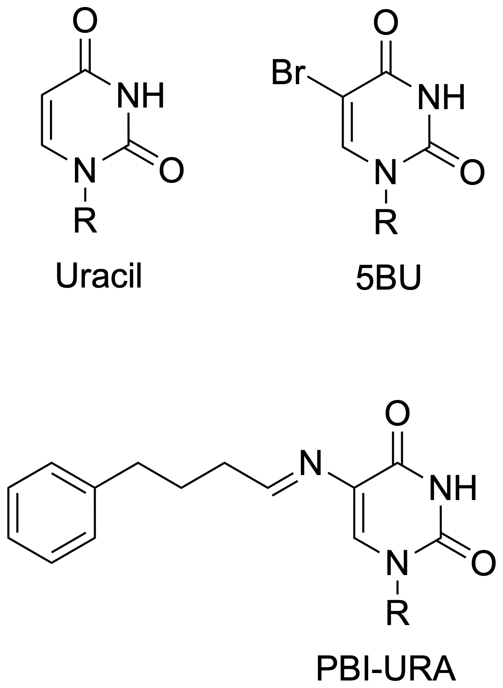

.. _tutorial4:

=========================
Tethered Docking (RNA receptor, in Python)
=========================

.. note::
    
    The presented example is experimental and its functionality or usage may change. It may not be included in the official release. The context is fictional and may not hold any biochemical significance.

This is a tethered (two-point attached covalent) docking example that uses the AutoDock-GPU executable to reproduce a covalent complex of a small molecule and an RNA receptor.

Follow the instructions to set up the environment and run this Python example on your own device (Linux, MacOS or WSL). 

Introduction
============

The covalent docking example is based on the two-point attractor and flexible sidechain method. In this example, a nonstandard nucleobase 5BU (5-bromo uracil) in the starting RNA structure (hammerhead ribozyme) undergoes covalent modification and forms a Schiff base (imine)-linked uracil. 

This tutorial is intended to showcase the Meeko usage in the preparation of receptor and ligand for tethered docking with an RNA receptor in Python. 

Environment Setup
=================

.. code-block:: bash

    micromamba create -c conda-forge -n meeko_tutorial_py39 python=3.9 -y
    micromamba activate meeko_tutorial_py39

    micromamba install -c conda-forge numpy scipy rdkit gemmi -y

    git clone --single-branch --branch rna_flex https://github.com/rwxayheee/Meeko.git
    cd Meeko; pip install --use-pep517 -e .; cd ..

    git clone --single-branch --branch develop https://github.com/forlilab/scrubber.git
    cd scrubber; pip install --use-pep517 -e .; cd ..

    pip install prody

Python Script
=============

`Meeko/example/tutorial4/rna_flex.py <https://github.com/rwxayheee/Meeko/blob/ce282c4d86a88fabe62199506addd976cb687ff7/example/tutorial4/rna_flex.py>`_

.. code-block:: python

    #!/usr/bin/env python

    from scrubber import Scrub
    from rdkit import Chem

    from meeko import CovalentBuilder
    import prody

    from meeko import MoleculePreparation
    preparator = MoleculePreparation()
    from meeko import PDBQTWriterLegacy
    from meeko import Polymer
    from meeko import ResidueChemTemplates

    def get_fragments_by_atom_indices(mol: Chem.Mol, 
                                    atom_idx1: int, atom_idx2: int) -> tuple[tuple[int], tuple[int]]:

        """
        Splits mol into two frags by bond between atoms w/ atom_idx1 and atom_idx2
        """

        bond = mol.GetBondBetweenAtoms(atom_idx1, atom_idx2)
        if bond is None:
            raise ValueError(f"No bond exists between the specified atom indices {atom_idx1, atom_idx2}.")

        emol = Chem.EditableMol(mol)
        emol.RemoveBond(atom_idx1, atom_idx2)
        mol = emol.GetMol()

        index_fragments = Chem.GetMolFrags(mol, asMols=False)
        if len(index_fragments) != 2:
            raise ValueError(f"Expected 2 fragments, but got {len(index_fragments)}.")

        frag1_indices, frag2_indices = index_fragments
        if atom_idx1 in frag1_indices:
            return (frag1_indices, frag2_indices)
        else:
            return (frag2_indices, frag1_indices)

    """
    Ligand Specifications
    """

    # Basename for the ligand
    lig_name = "PBI_URA"

    # Ligand Smiles, preferably isomeric Smiles w/ a specified protonation state
    mysmi = "CN(C(N1)=O)C=C(/N=C/CCCC2=CC=CC=C2)C1=O"

    # Smarts pattern and indices in Smarts pattern 
    # to define covalent atoms within the ligand
    tether_smarts, tether_smarts_indices = ("[CH3][NX3H0]", (0,1))
    # The closer atom to the receptor core needs to be put first, 
    # followed by the other atom that is closer to the ligand. 

    """
    Receptor Specifications
    """

    # PDB ID or PDB filename of the starting receptor structure
    pdb_token = "3zd5"

    # ProDy selection language to define receptor atoms
    rec_atoms_selection = "not water"

    # A string to define two "attractor" atoms within the receptor
    # Format: 
    # "Chain_ID:Residue_Name:Residue_Number:Atom_Name1,Atom_Name2"
    cov_atoms_selection = "B:5BU:11:C1',N1"
    # The closer atom to the receptor core needs to be put first, 
    # followed by the other atom that is closer to the ligand. 

    """
    Prepare Ligand
    """

    mymol = Chem.MolFromSmiles(mysmi)
    Chem.AddHs(mymol)
    Chem.SanitizeMol(mymol)
    scrub = Scrub(skip_acidbase=True, skip_tautomers=True)
    scrubbed_mols = list(scrub(mymol))

    print(f"Number of scrubbed mols: {len(scrubbed_mols)}")
    mol_0 = scrubbed_mols[0]

    pdb_prody_mol = prody.parsePDB(pdb_token)
    rec_prody_mol = pdb_prody_mol.select(rec_atoms_selection)
    builder = CovalentBuilder(rec_prody_mol, cov_atoms_selection)

    chain, res, num, cov_atom_names = cov_atoms_selection.split(":")
    cov_name1, cov_name2 = (x.strip() for x in cov_atom_names.split(","))
    lig_counter = 0
    for cov_lig in builder.process(mol_0, tether_smarts, tether_smarts_indices):
        root_atom_index = cov_lig.indices[0]
        molsetups = preparator.prepare(
                        cov_lig.mol,
                        root_atom_index=root_atom_index,
                        not_terminal_atoms=[root_atom_index],
                    )
        for molsetup in molsetups:
            pdbqt_string, success, error_msg = PDBQTWriterLegacy.write_string(molsetup)
            if success:
                pdbqt_string = (
                    PDBQTWriterLegacy.adapt_pdbqt_for_autodock4_flexres(
                        pdbqt_string, res, chain, num, skip_rename_ca_cb=True
                        )
                    )
                lig_counter += 1
                lig_fn = f"{lig_name}_{lig_counter}.pdbqt" 
                with open(lig_fn, "w") as f:
                    f.write(pdbqt_string)
                print(f"File written: {lig_fn}")
            else:
                print(error_msg)

    print(f"Number of prepared ligs: {lig_counter}")

    """
    Prepare Receptor
    """

    templates = ResidueChemTemplates.create_from_defaults()
    polymer = Polymer.from_prody(
        rec_prody_mol,
        templates,
        preparator,
        default_altloc="A",
    )

    res_id = f"{chain}:{num}"
    res_atom_names = polymer.monomers[res_id].atom_names
    atom_idx1, atom_idx2 = (res_atom_names.index(cov_name1), res_atom_names.index(cov_name2))

    keep_indices, delete_indices = get_fragments_by_atom_indices(polymer.monomers[res_id].rdkit_mol, 
                                                atom_idx1, atom_idx2)
                                                
    for atom_idx in delete_indices: 
        molsetup_mapidx = {v:k for k,v in polymer.monomers[res_id].molsetup_mapidx.items()}
        polymer.monomers[res_id].molsetup.delete_atom(molsetup_mapidx[atom_idx])

    rec_fn = f"{pdb_token}_rec.pdbqt"
    with open(rec_fn, "w") as f:
        f.write(PDBQTWriterLegacy.write_from_polymer(polymer)[0])
    print(f"File written: {rec_fn}")

Output Files: 

- `3zd5_rec.pdbqt <https://github.com/rwxayheee/Meeko/blob/ce282c4d86a88fabe62199506addd976cb687ff7/example/tutorial4/3zd5_rec.pdbqt>`_

- `PBI_URA_1.pdbqt <https://github.com/rwxayheee/Meeko/blob/ce282c4d86a88fabe62199506addd976cb687ff7/example/tutorial4/PBI_URA_1.pdbqt>`_

What's Next?
============

1. GPF Preparation 

.. code-block:: bash

    gunzip 3zd5.pdb.gz

    # make a copy of ligand pdbqt file without _RES remark
    # this copy will be used to generate GPF only
    grep -v _RES PBI_URA_1.pdbqt > PBI_URA_1_noRES.pdbqt
    mk_prepare_receptor.py -i 3zd5.pdb -o 3zd5 -p -g \
    --box_enveloping PBI_URA_1_noRES.pdbqt --padding 8

    # make a copy of GPF 
    # replace the receptor file basename by the previously used one
    # in Python, it was 3zd5_rec
    cp 3zd5.gpf 3zd5_rec.gpf 
    if [[ "$OSTYPE" == "darwin"* ]]; then
    sed -i '' "s/3zd5/3zd5_rec/g" 3zd5_rec.gpf
    else
    sed -i "s/3zd5/3zd5_rec/g" 3zd5_rec.gpf
    fi

2. Map Calculation

.. code-block:: bash

    ./autogrid4 -p 3zd5_rec.gpf 

3. Docking Calculation

.. code-block:: bash

    ./adgpu --flexres PBI_URA_1.pdbqt --ffile 3zd5_rec.maps.fld --resnam 3zd5_PBI_URA

4. Export Poses to SDF

.. code-block:: bash

    # export cluster lead
    mk_export.py 3zd5_PBI_URA.dlg -s 3zd5_PBI_URA_adgpu_out.sdf -k 
    # or all poses
    mk_export.py 3zd5_PBI_URA.dlg -s 3zd5_PBI_URA_adgpu_all.sdf -k --all_dlg_poses

`Tutorial Files and Expected outputs <https://github.com/rwxayheee/Meeko/tree/ce282c4d86a88fabe62199506addd976cb687ff7/example/tutorial4>`